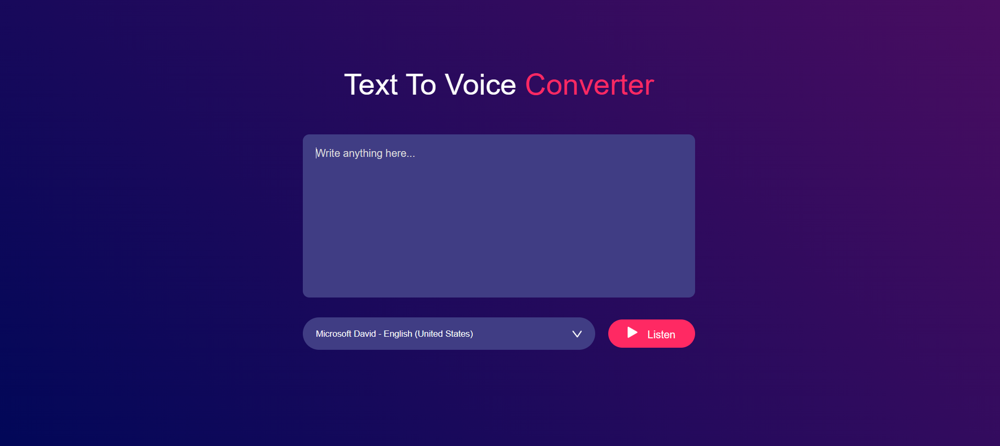

# Text-to-Speech Converter

A simple web-based **Text-to-Speech (TTS) converter** built with HTML, CSS, and JavaScript.  
Type text in the textarea, select a voice from the dropdown, and click **Listen** to hear it spoken aloud using the browser’s built-in SpeechSynthesis API.

---

## Features

- Convert any text to speech in real-time.
- Select from multiple available system voices.
- User-friendly and responsive UI.
- Works in modern browsers: Chrome, Edge, Firefox, Safari.

---

## Demo

  

--
